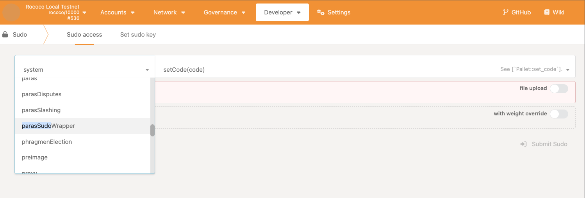
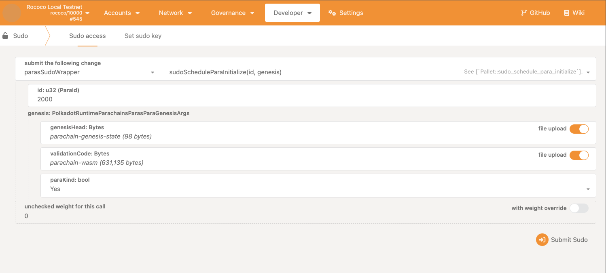
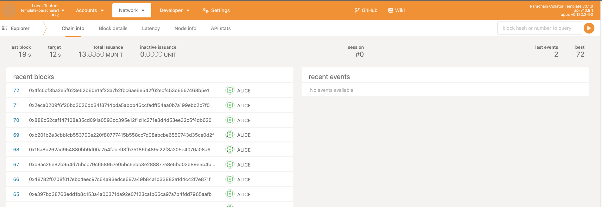

Typically, a parachain slot auction would have to take place to achieve a connection with the relay
chain. These auctions can take some time - usually one week, with multiple parachains competing for
a slot in the relay chain.

One possibility is to modify our relay chain's code to lower auction times. However, this still is
unideal for development purposes.

A significant side effect of running our local relay chain includes bypassing that process via our
type of governance - `sudo`.

## A Brief Introduction to the Sudo Pallet

The [`sudo`](https://paritytech.github.io/polkadot-sdk/master/pallet_sudo/index.html) pallet
executes calls that require `Root` origin with any keys that are declared as "sudo". In most
development environments, `Alice` is one of these keys. Adding more keys if needed via the `set_key`
extrinsic is also possible.

It primarily acts as a wrapper for other calls. It is not meant to be used in pallets directly but
rather merely execute privileged calls that require the `Root` origin.

## Using Sudo as Governance in Polkadot.js

Using the `sudo` pallet, we can bypass the auction process and register the parachain directly.

:::caution Make sure your collator is running!

To register our parachain, we need both our relay chain creating blocks and our parachain's collator
running.

:::

Navigate to the
[Polkadot.js Developer Console](https://polkadot.js.org/apps/?rpc=ws%3A%2F%2F127.0.0.1%3A9944#/explorer),
and select the `Sudo` tab:

Once here, select the `parasSudoWrapper` in the dropdown, then the `sudoScheduleParaInitialize`
extrinsic:



Upload the genesis (`parachain-genesis-state`) and runtime (`parachain-wasm`) from the
`parachain-guide-resources` repository:



In the "Events" tab in the explorer, you should see two events - `sudo.Sudid` and
`paras.PvfCheckAccepted`. These should indicate that the parachain's runtime has been successfully
registered, and the collator will start syncing with the relay chain. If not, you may have forgotten
to specify a bootnode. You may restart your collator and specify a relay chain validator using the
`--bootnodes` flag, followed by the peer address of either `alice` or `bob`.


:::info Upgrading a parathread

In the event that you have a parathread, it can also be upgraded via the `parasSudoWrapper` with the
`sudoScheduleParathreadUpgrade` extrinsic, where you only need to supply the ParaID.

:::

## Ensuring Collation

Your collator should have output similar to the following:

```sh
2023-09-13 13:03:48 [Parachain] 🙌 Starting consensus session on top of parent 0x8d239901c4ee0eca7b10f97744bd2812e2682cd92a3e15c254931fb631af6289
2023-09-13 13:03:48 [Parachain] 🎁 Prepared block for proposing at 198 (1 ms) [hash: 0xd5ab5c88bbc45c00500059d001303961fc43c2821f21c9939b44be5ec983dfb9; parent_hash: 0x8d23…6289; extrinsics (2): [0xc24e…cf43, 0xc8c9…86a5]
2023-09-13 13:03:48 [Parachain] 🔖 Pre-sealed block for proposal at 198.  Hash now 0x17eb48b6a0cca5cabfa3651961732b4095fa9a7edc77066ba310d3243342fba2, previously 0xd5ab5c88bbc45c00500059d001303961fc43c2821f21c9939b44be5ec983dfb9.
2023-09-13 13:03:48 [Parachain] ✨ Imported #198 (0x17eb…fba2)
2023-09-13 13:03:48 [Parachain] PoV size { header: 0.21875kb, extrinsics: 3.1298828125kb, storage_proof: 3.2939453125kb }
2023-09-13 13:03:48 [Parachain] Compressed PoV size: 6.048828125kb
2023-09-13 13:03:48 [Parachain] Produced proof-of-validity candidate. block_hash=0x17eb48b6a0cca5cabfa3651961732b4095fa9a7edc77066ba310d3243342fba2
```

In Polkadot.js, you should also see block production occurring on the parachain:


